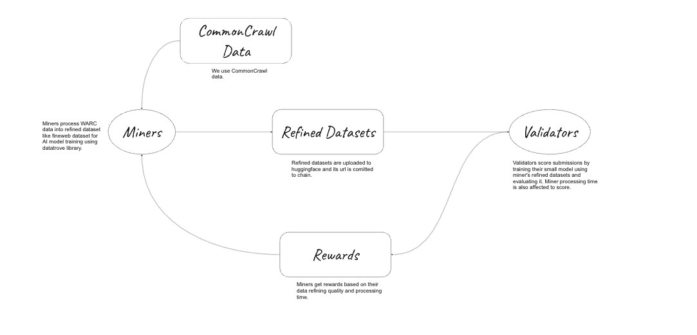
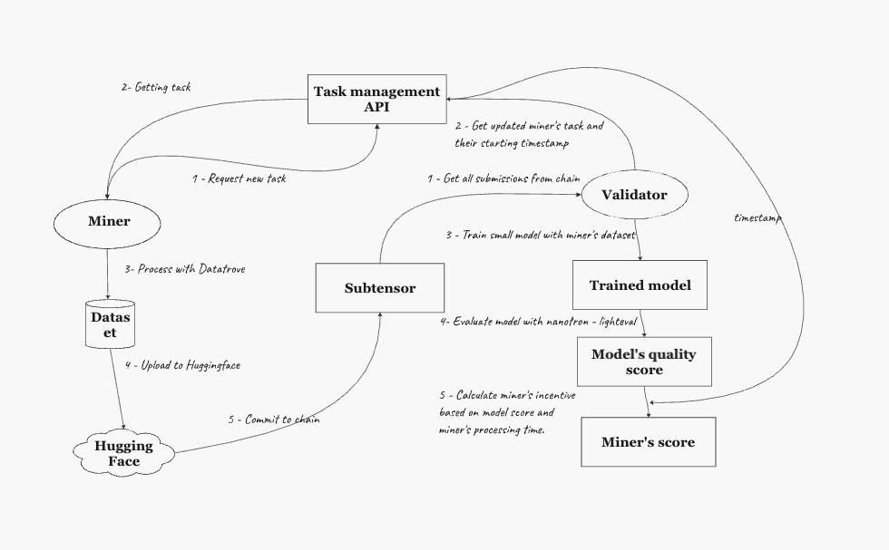

<div align="center">

# **Data Refine Subnet** <!-- omit in toc -->
[](https://discord.gg/bittensor)
[](https://opensource.org/licenses/MIT) 

---

## Refining Dataset powered by Decentralized network <!-- omit in toc -->

[Discord](https://discord.gg/bittensor) • [Network](https://taostats.io/) • [Research](https://bittensor.com/whitepaper)
</div>

---
- [Introduction](#introduction)
- [Main Mechanism](#main-mechanism-of-subnet)
- [Roadmap](#roadmap)
- [Installation](#installation)
---

## Introduction

**IMPORTANT**: If you are new to Bittensor subnets, read about [Bittensor Network](https://bittensor.com/whitepaper) and feel the power.  


The performance of large language models (LLMs) is significantly influenced by the quality and scale of their pretraining datasets. While the pretraining datasets for cutting-edge open LLMs like LLaMA 3 and Mixtral are not publicly available, and little is known about their creation, a new large-scale dataset, [FineWeb](https://huggingface.co/datasets/HuggingFaceFW/fineweb), has recently emerged. FineWeb consists of 15 trillion tokens (44TB of disk space) derived from 96 snapshots of [CommonCrawl](https://commoncrawl.org/), and has demonstrated superior performance compared to other open pretraining datasets.
Here's the related blog post - [https://huggingface.co/spaces/HuggingFaceFW/blogpost-fineweb-v1](https://huggingface.co/spaces/HuggingFaceFW/blogpost-fineweb-v1)

In our project, we leverage the same algorithm used to create the FineWeb dataset to build our own, even larger, and higher-performing dataset. This dataset will be enhanced and powered by the decentralized Bittensor network.

The Data Refine Subnet implements an optimized dataset creation mechanism, featuring the following neuron types:

	- Miners: Responsible for generating refined datasets from raw crawled data.
	- Validators: Tasked with evaluating the performance of miners and ensuring the quality of the datasets produced.

Both of them are getting rewards via tao according their score and trust in network.
<div align="center">
   <picture>
      
    </picture>
</div>

<p align="center">
   Subnet Diagram
</p>

## Main Mechanism of Subnet

Miners receive tasks from the task server via the task retrieval API. The task server manages and organizes these tasks, primarily splitting the CommonCrawl data and tracking miners’ status. After processing the task, miners upload the refined dataset to their Hugging Face repository and submit the commit, including the Hugging Face URL, to the blockchain.

Validators periodically check miners’ commits every x blocks to retrieve new submissions. They then evaluate the elapsed time and the quality of the resulting dataset. Based on the miner’s performance, the validators assign weights according to the miners’ scores.

```
-- how to evaluate dataset --

Validators train a small model using the miner’s dataset and assess the dataset quality based on the model’s accuracy. If the trained model performs well, it indicates that the dataset is of high quality. Conversely, if the model performs poorly, it suggests that the dataset quality is suboptimal. This method allows for an effective evaluation of the dataset quality.

```

<div align="center">
   <picture>
      
    </picture>
</div>

<p align="center">
   Machanism Diagram
</p>


## Roadmap

### Phase 1: Architecture & Subnet Design

- [x] Design Data Refine Subnet
    - [x] Miner Node Design
    Create miner nodes that retrieve raw CommonCrawl data, process tasks, and generate refined datasets.
    - [x] Validator Node Design
    Build validator nodes to evaluate the performance of miners by checking dataset quality based onmodel training results.
- [x] Task Server and API Development
    - [x] Build the task server responsible for distributing dataset creation tasks to miners.
    - [x] Develop the task retrieval API to manage communication between the server, miners, and validators.
- [x] Blockchain Integration
    - [x] Implement the mechanism for miners to submit commits (with Huggingface URLs) and validators to record evaluations on the blockchain.
    - [x] Set up scoring and rewarding systems which distribute Tao tokens based on performance metrics.

### Phase 2: Development and Testing

- [x] Develop Miner and Validator Nodes
    - [x] Write the core code for miners to retrieve, process, and upload datasets.
    - [x] Write code for validators to retrieve commits, check dataset quality, and assign scores.
- [x] Dataset Quality Evaludation Algorithm
    - [x] Implement the model training and accuracy assessment algorithm for validators to judge dataset quality effectively.
- [x] Prototype Testing
    - [x] Conduct small-scale tests with miners and validators on the Bittensor test network.
    - [x] Assess the scalability of the system, including data retrieval, processing speed, and evaluation accuracy.
- [ ] Reward Mechanism Deployment
    - [ ] Deploy mechanism for distributing rewards in Tao tokens, ensuring fairness and transparency in payouts.

### Phase 3: Website Development

- [x] Website Architecture and Design
    - [x] Design a user-friendly interface showcasing an overview of the Data Refine Subnet, with clear navigation for key features (e.g., subnet performance, miner/validator statistics, etc.).
    - [x] Create wireframes and mockups for the website, ensuring responsiveness across all devices.
    - [x] Define the technology stack for the website (e.g., React, Next.js, Tailwind CSS, or other frameworks based on your needs).
- [ ] Subnet Overview Page
    - [x] Dataset creation progress (e.g., tokens generated, dataset size).
    - [ ] Number of active miners and validators.
    - [ ] Task server activity and status tracking.
- [ ] Miner and Validator Leaderboards.
    - [ ] Performance metrics: Dataset quality score, token rewards, time to complete tasks.
    - [ ] Ranking system: Display top-performing miners and validators.
- [ ] API Integration and Data Visualization
    - [ ] Integrate APIs to retrieve real-time data from the blockchain and display metrics like rewards, performance, and task completion rates.
    - [ ] Use data visualization tools (e.g., charts, graphs) to show trend analytics over time.
- [ ] User Interaction and Community Features
    - [ ] Enable user registration and create a dashboard for miners and validators to view personal stats.
    - [ ] Add a community forum or discussion section for miners and validators to exchange ideas and report bugs.
- [ ] Security and Authentication
    - [ ] Ensure secure access to sensitive data with proper authentication mechanisms (OAuth, JWT).
    - [ ] Add secure access points for miners and validators to update their profiles, task completions, and repositories.

### Phase 4: Document Development

- [x] Project Overview Documentation
    - [x] Develop a comprehensive introduction to the project, covering the vision, architecture, and objectives.
    - [ ] Include diagrams and flowcharts to explain the role of miners, validators, the task server, and the decentralized mechanisms.
- [ ] Subnet and Task Server Documentation
    - [ ] The process of task retrieval and submission.
    - [ ] Communication between miners and validators.
    - [ ] Blockchain integration for task tracking and rewards distribution.
    - [ ] Create a task server setup guide, including API documentation for developers to integrate with the system.
- [ ] Miner and Validator Onboarding Guide
    - [ ] Create a step-by-step guide for new miners to set up their nodes, retrieve tasks, process datasets, and submit them to Hugging Face.
    - [ ] Write detailed documentation on how validators can evaluate miner performance, check dataset quality, and assign scores.
    - [ ] Include troubleshooting sections to address common setup or performance issues.

### Phase 5: Launch and Community Engagement
- [ ] Mainnet Deployment
    - [ ] Move the system from the testnet to the mainnet, ensuring stability and readiness for full-scale use.
    - [ ] Announce the official launch of the dataset creation mechanism.
- [ ] Community Building and Onboarding
    - [ ] Engage with the developer and data science communities to onboard miners and validators.
    - [ ] Organize webinars and tutorials on how to contribute to the network.
- [ ] Partnerships and Expansion
    - [ ] Establish partnerships with organizations that require large-scale datasets for AI models. (e.g. Pretraining Subnet)
    - [ ] Explore potential collaborations with academic institutions or AI research labs.

### Phase 6: Continuous Improvement and Version 2.0
- [ ] Dataset Expansion
    - [ ] Continue improving the dataset by increasing token count and refining quality.
    - [ ] Introduce other data sources besides CommonCrawl to diversify the dataset.
- [ ] AI Integration and Automation
    - [ ] Explore opportunities for automating certain aspects of dataset generation and validation using AI.
    - [ ] Potentially introduce advanced algorithms for refining the data even further.
- [ ] Performance and Feedback Loop
    - [ ] Regularly evaluate miner and validator performance and tweak the reward mechanisms as needed.
    - [ ] Collect feedback from network participants and use it to improve future versions of the platform.

## Installation

- [Miners](./docs/miner.md)
- [Validators](./docs/validator.md)


## License
This repository is licensed under the MIT License.
```text
# The MIT License (MIT)
# Copyright © 2023 Yuma Rao

# Permission is hereby granted, free of charge, to any person obtaining a copy of this software and associated
# documentation files (the “Software”), to deal in the Software without restriction, including without limitation
# the rights to use, copy, modify, merge, publish, distribute, sublicense, and/or sell copies of the Software,
# and to permit persons to whom the Software is furnished to do so, subject to the following conditions:

# The above copyright notice and this permission notice shall be included in all copies or substantial portions of
# the Software.

# THE SOFTWARE IS PROVIDED “AS IS”, WITHOUT WARRANTY OF ANY KIND, EXPRESS OR IMPLIED, INCLUDING BUT NOT LIMITED TO
# THE WARRANTIES OF MERCHANTABILITY, FITNESS FOR A PARTICULAR PURPOSE AND NONINFRINGEMENT. IN NO EVENT SHALL
# THE AUTHORS OR COPYRIGHT HOLDERS BE LIABLE FOR ANY CLAIM, DAMAGES OR OTHER LIABILITY, WHETHER IN AN ACTION
# OF CONTRACT, TORT OR OTHERWISE, ARISING FROM, OUT OF OR IN CONNECTION WITH THE SOFTWARE OR THE USE OR OTHER
# DEALINGS IN THE SOFTWARE.
```
